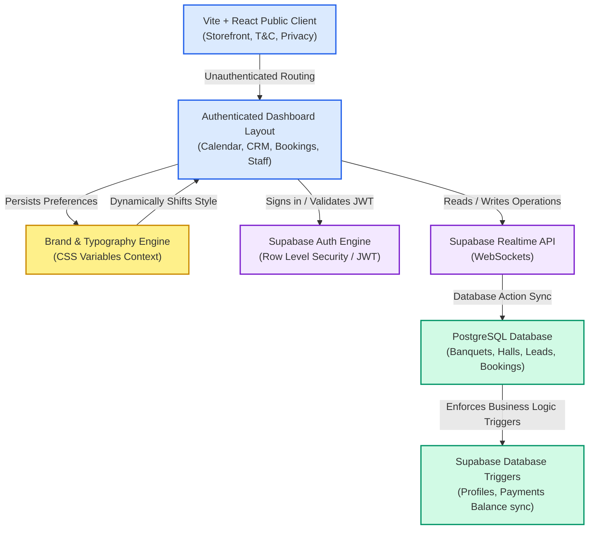
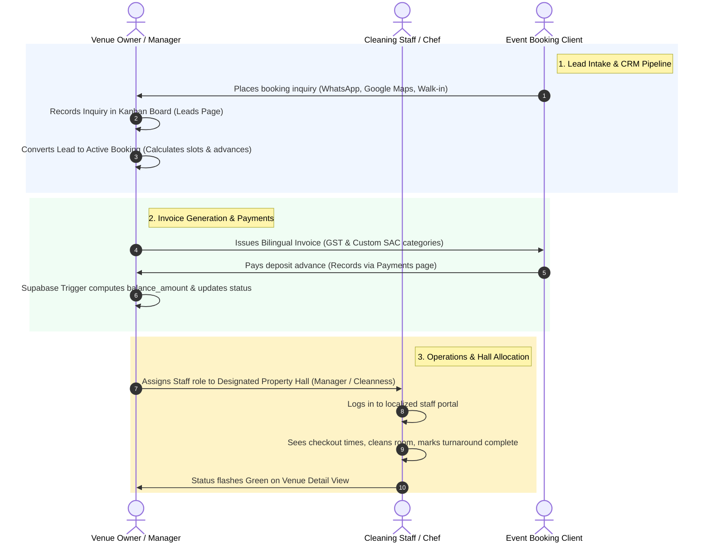
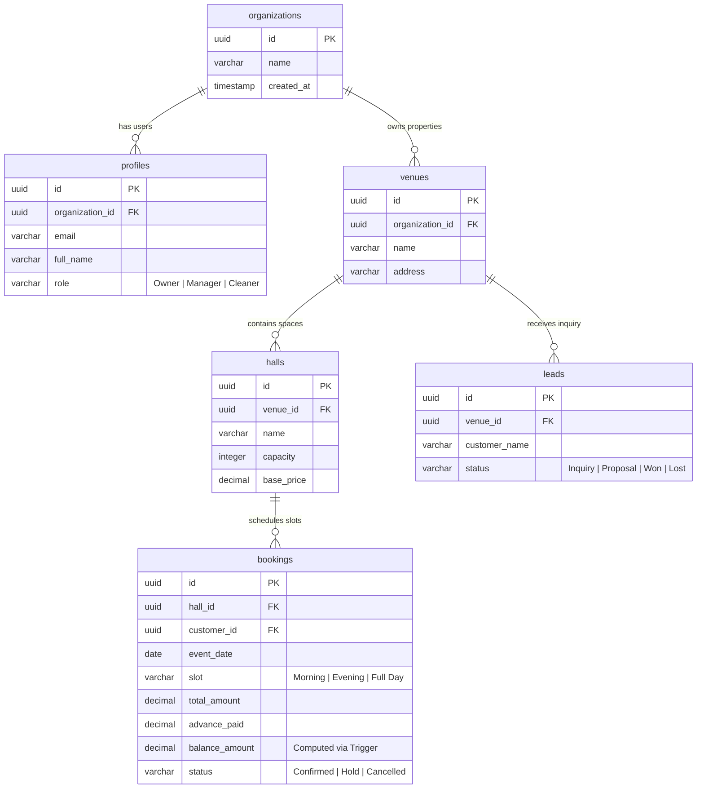

# 🗺️ VenuePro System Architecture & User Flow Guide

Welcome to the definitive structural documentation for **VenuePro**. This document explains the operational flow, system connectivity, database schema mappings, and how different application sectors communicate in real-time.

---

## 1. ⚙️ High-Level System Connectivity

VenuePro is built as a highly responsive, multi-tenant B2B SaaS application. It uses a modern decoupled architecture connecting a dynamic client interface to a secure backend.

---

## 2. 👥 User Roles & Operational Flow

VenuePro partitions operations among three primary user personas, ensuring secure access control throughout the venue workspace.

---

## 3. 💾 PostgreSQL Relational Schema Schema Map

At the core of our database engine lie highly structured tables guarded by Supabase Row-Level Security (RLS). Here is how keys are referenced:

---

## 🛡️ Key Architectural Principles
1. **Dynamic Design Real-Time Re-rendering:** The `Brand & Design System` console dynamically injects and modifies custom properties (`--global-font`, `--primary`, `--accent`) straight to the `document.documentElement` object in React. This re-paints all tailwind-themed components instantaneously without full page refreshes.
2. **Atomic SQL Integrity:** Balance calculations are processed by a database trigger ([20260517000004_fix_schema_mismatches.sql](file:///c:/Users/kskis/.gemini/antigravity/scratch/VenuePro/supabase/migrations/20260517000004_fix_schema_mismatches.sql)), ensuring that `balance_amount = total_amount - advance_paid` is computed server-side. This completely eliminates manual synchronization bugs!
3. **Decoupled Security Layer:** Every query from our custom hooks uses standard JWT parameters issued by Supabase Auth, mapping queries specifically to the authenticated user's `organization_id` (RLS).
